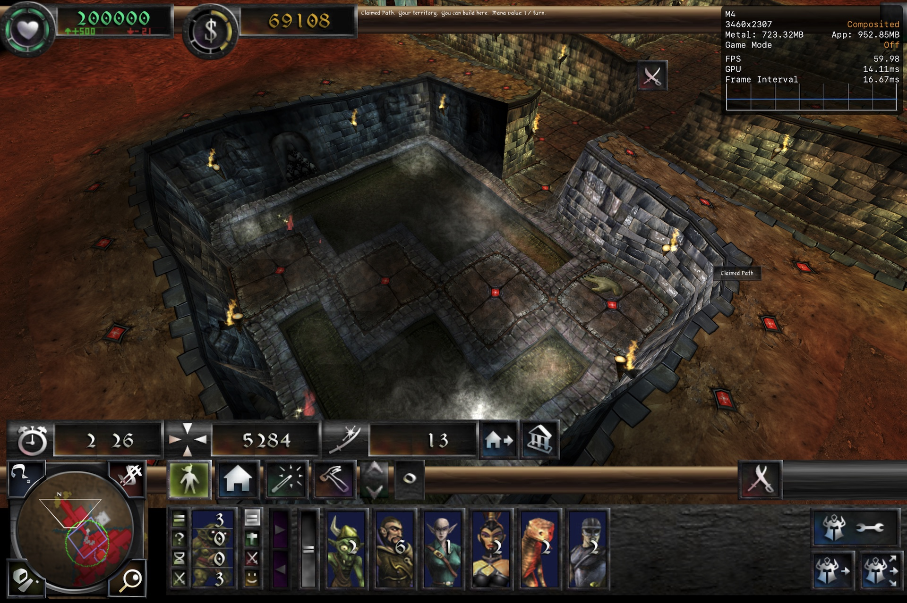

# Flametal



Dungeon Keeper 2 running natively on Apple Silicon. Flametal is a preservation fork of [DiaLight/Flame](https://github.com/DiaLight/Flame): the game's original 32-bit simulation runs isolated in Wine, while a native AppKit/Metal 4 host renders its captured Direct3D 3 command stream — no WineD3D, real fullscreen, native input, display-aspect matching, optional HD textures.

No game data is included or distributed. A legally obtained Dungeon Keeper 2 (GOG 1.7) copy is required.

## Install (macOS, Apple Silicon)

1. Download `Flametal-*-macos.zip` from [releases](https://github.com/nasedkinpv/Flametal/releases) and unzip.
2. The app is not notarized yet, so macOS reports it as "damaged". Clear the quarantine flag once:
   ```sh
   xattr -cr "/path/to/Dungeon Keeper II.app"
   ```
3. Open the app and point it at your Dungeon Keeper 2 (GOG 1.7) installation. It is imported into a private prefix; the original stays untouched.

For Windows, use the upstream [Flame releases](https://github.com/DiaLight/Flame/releases).

Note: saves and network sessions between Flame/Flametal and unpatched Dungeon Keeper 2 are [incompatible](https://github.com/DiaLight/Flame/issues/57) (`-original-compatible` disables the incompatible patches).

Bugs: [GitHub issues](https://github.com/nasedkinpv/Flametal/issues), with reproduction steps when possible.

## Developing

Build, packaging, import and run instructions for the macOS edition: [macos/README.md](macos/README.md). The Windows DLL (`Flametal.dll` + `PATCH.dll` loader chain) builds with CMake 3.25+, Visual Studio 2022 (x86), Python 3, and a Dungeon Keeper II v1.70 installation; see the upstream project for the function-replacement architecture.

## Credits and licensing

All of the original decompilation work, the DLL function-replacement approach, and the game bug fixes are [DiaLight](https://github.com/DiaLight)'s, from the upstream [Flame](https://github.com/DiaLight/Flame) project. Flametal builds the native macOS edition on top of that foundation.

See [LICENSE](LICENSE): the Flametal macOS additions are MIT; the inherited Flame decompilation carries no explicit upstream license; Dungeon Keeper 2 remains (c) Electronic Arts.
