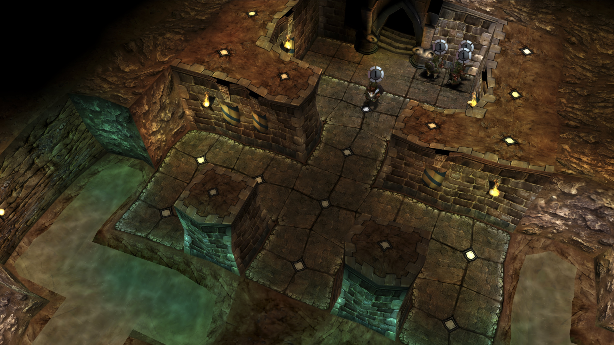
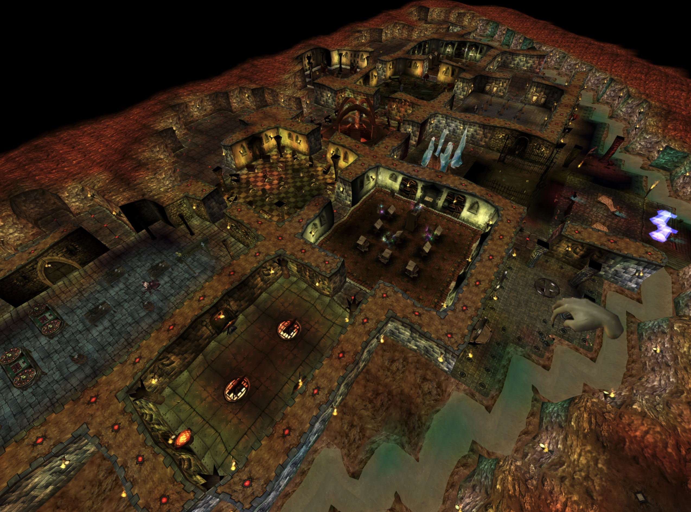
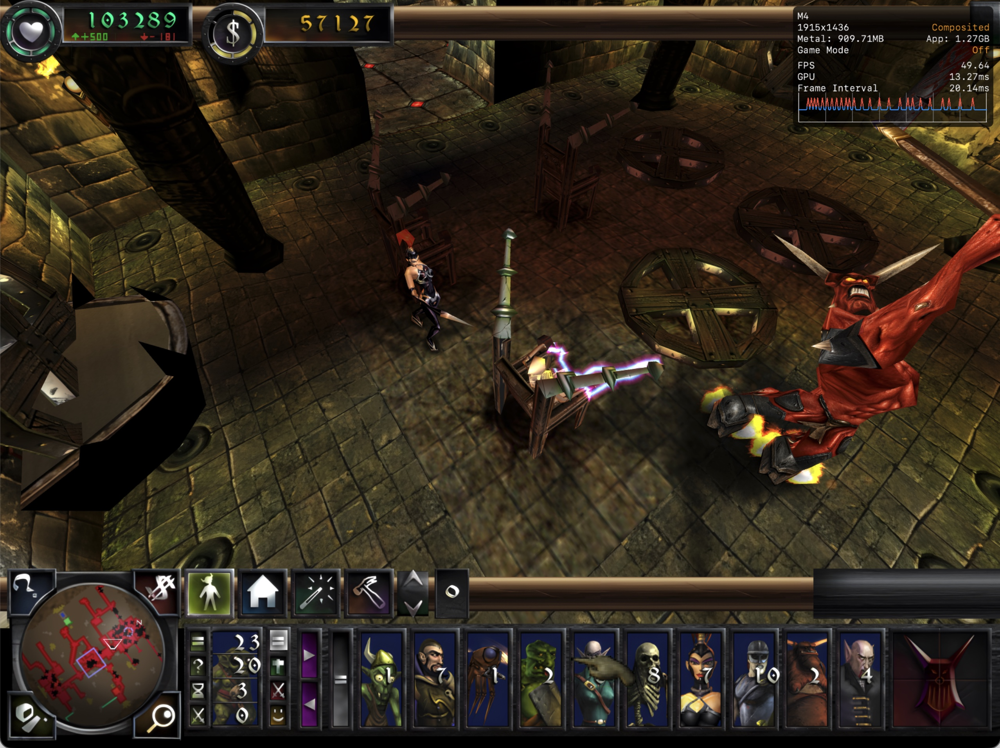

# Flametal





*Native Metal 4 rendering with bloom post-processing, named HD texture atlases, and GPU-rasterized original projected shadows.*



Flametal is an independent preservation project for Dungeon Keeper 2 on modern Apple Silicon Macs. It originated as a fork of [DiaLight's Flame](https://github.com/DiaLight/Flame) and retains parts of its decompilation lineage, but the current macOS runtime is Flametal's own architecture: the original 32-bit game simulation runs in an isolated Wine process while a native AppKit/Metal 4 host owns rendering, presentation, and input. WineD3D is not used; Flametal provides real fullscreen, display-aware scaling, bloom, projected Metal shadows, and optional HD textures.

Flametal ships no game data. A legally obtained Dungeon Keeper 2 (GOG 1.7) copy is required.

## Install (macOS, Apple Silicon)

1. Download `Flametal-*-macos.zip` from [releases](https://github.com/nasedkinpv/Flametal/releases) and unzip.
2. The app is not notarized yet, so macOS reports it as "damaged". Clear the quarantine flag once:
   ```sh
   xattr -cr "/path/to/Dungeon Keeper II.app"
   ```
3. Open the app and point it at your Dungeon Keeper 2 (GOG 1.7) installation. It is imported into a private prefix; the original stays untouched.

For Windows, use the upstream [Flame releases](https://github.com/DiaLight/Flame/releases).

Note: saves and network sessions between Flame/Flametal and unpatched Dungeon Keeper 2 are [incompatible](https://github.com/DiaLight/Flame/issues/57) (`-original-compatible` disables the incompatible patches).

Report bugs through [GitHub issues](https://github.com/nasedkinpv/Flametal/issues), with reproduction steps when possible.

## Why this approach

- **Why not Proton / CrossOver / Game Porting Toolkit?** Those translate modern Direct3D (10/11/12) to Metal. Dungeon Keeper 2 is a 1999 Direct3D 3 / DirectDraw title — the modern layers don't cover that era at all, and Wine's own fallback (WineD3D over deprecated macOS OpenGL) is exactly the slow, glitchy path this project replaces.
- **Why not an existing D3D translation layer?** There is no production layer for D3D3-era APIs on Metal. dgVoodoo2 is Windows-only, DXVK starts at D3D8, and D7VK is an experimental D3D7-to-Vulkan layer that would still need MoltenVK underneath — another stack of translations for an API older than it targets.
- **Why this way?** Flametal intercepts rendering inside the game engine, before Wine's graphics stack: the captured command stream is replayed by a native Metal 4 renderer, hot x87 engine code is translated to modern SIMD, and the original simulation stays isolated in Wine. Fewer layers today, and a realistic path to iOS tomorrow — a translation stack cannot make that jump, a native renderer can.

Made out of love for Dungeon Keeper 2 and Bullfrog, with AI assistance (Fable & Codex).

## Developing

Build, packaging, import and run instructions for the macOS edition: [macos/README.md](macos/README.md). The Windows DLL (`Flametal.dll` + `PATCH.dll` loader chain) builds with CMake 3.25+, Visual Studio 2022 (x86), Python 3, and a Dungeon Keeper II v1.70 installation; see the upstream project for the function-replacement architecture.

## Credits and licensing

Flametal originated as a fork of [DiaLight's Flame](https://github.com/DiaLight/Flame). DiaLight created the original decompilation and DLL function-replacement machinery that remains in parts of this tree. Flametal's macOS runtime, headless DirectDraw bridge, shared rendering protocol, Metal renderer, native input and settings, HD resource pipeline, and subsequent engine work are developed here as a separate Dungeon Keeper 2 preservation effort.

See [LICENSE](LICENSE): the Flametal macOS additions are MIT; the inherited Flame decompilation carries no explicit upstream license; Dungeon Keeper 2 remains (c) Electronic Arts.
